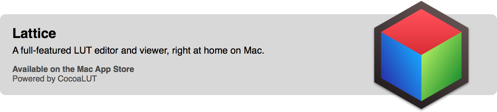

# CocoaLUT

CocoaLUT is a tool for importing, exporting, and manipulating [3D look up tables](https://en.wikipedia.org/wiki/3D_lookup_table) (3D LUTs) and 1D look up tables (1D LUTs) for colors. LUTs are often used in film and video finishing, graphics, video games, and rendering.

The goal of this project is to have a fast, modern Objective-C (and soon, Swift) library that works on both iOS and OS X.

## Features

- Reads and writes 3D LUTs
  - DaVinci Resolve Cube LUT (.cube)
  - Autodesk 3D LUT (.3dl)
  - Quantel 3D LUT (.txt)
  - FSI DAT 3D LUT (.dat)
  - DVS Clipster 3D LUT (.xml, .txt)
  - Nucoda CMS LUT (.cms)
  - Resolve DAT 3D LUT (.dat)
  - DaVinci 3D LUT (.davlut)
  - Unwrapped Texture LUT Image (.tiff, .dpx, .png)
  - CMS Test Pattern LUT Image (.tiff, .dpx, .png)
  - Hald CLUT Image (.tiff, .dpx, .png)
- Reads and writes 1D LUTs
  - DaVinci Resolve Cube LUT (.cube)
  - Nucoda CMS LUT (.cms)
  - DaVinci Resolve 1D LUT (.ilut, .olut)
  - Discreet 1D LUT (.lut)
  - Arri Look 1D tone map only (.xml) 
- Reads non-LUT formats as LUTs
  - Arri Look (.xml) as a 3D LUT
  - ICC/ColorSync Profiles (.icc, .icm, .pf, .prof) as a 3D LUT *(OS X only)*
- Has a format-independent internal data structure. You can create LUTs and use them in-memory.
- Apply LUTs to NSImage, CIImage, and UIImage
- Generate Core Image Filters ([VVLUT1DFilter](https://github.com/videovillage/VVLUT1DFilter) / CIColorCube) from LUTs
- Generate visualizations for LUTs with Scene Kit
- Resize LUTs
- Reverse 1D LUTs
- Extract the color shift from a 3D LUT
- Extract the contrast shift from a 3D LUT
- Convert the color space or color temperature of a LUT

## Installation

CocoaLUT is available through [CocoaPods](http://cocoapods.org), to install
it simply add the following line to your Podfile:

    pod 'CocoaLUT'

## Related

This project uses [LUTSpec](http://github.com/wilg/LUTSpec) for UTI standardization.

Do you need something like this in Python? Try [pylut](http://github.com/gregcotten/pylut).

## Authors

- [Wil Gieseler](https://github.com/wilg) (@wilg)
- [Greg Cotten](https://github.com/gregcotten) (@gregcotten)
- [Tashi Trieu](https://github.com/tashdor) (@tashitrieu) - Additional Color Science

## License

CocoaLUT is available under the MIT license. See the LICENSE file for more info.

